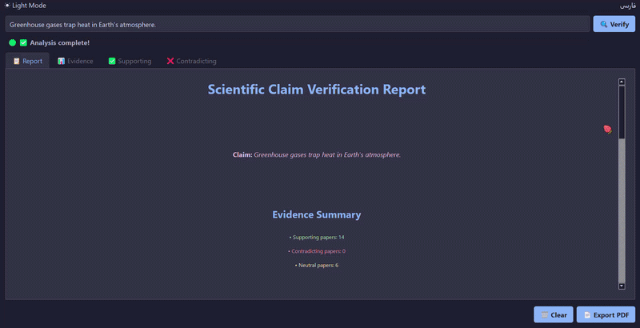
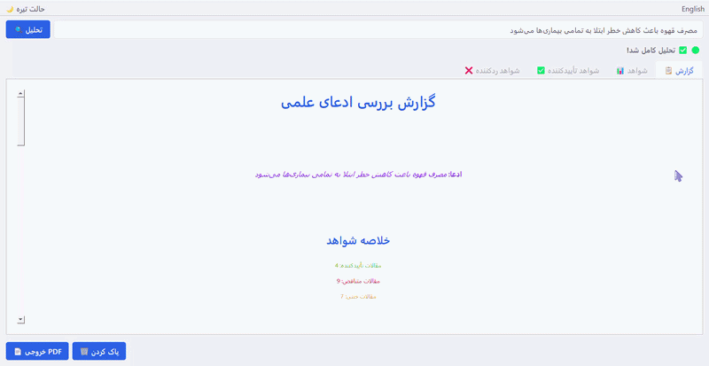
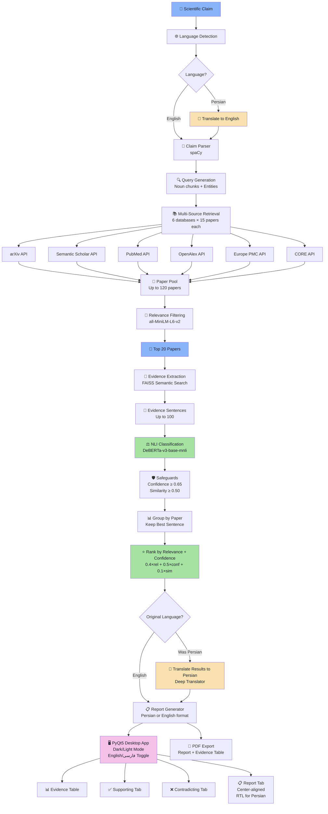

# 🔬 Scientific Claim Verifier & Evidence Explorer

[](https://www.python.org/downloads/)
[](LICENSE)
[]()
[]()
[]()
[]()


> **Not a truth detector.** A research assistant that retrieves, analyzes, and organizes scientific evidence so you can make informed judgments about scientific claims.

---

## 🎯 Motivation

Scientific claims spread faster than ever. Researchers, students, journalists, and curious minds need a way to quickly survey the evidence landscape around a claim — without reading hundreds of papers.

**This tool is built to answer:**

- *Is there evidence supporting this claim?*
- *Is there evidence contradicting it?*
- *How consistent is the scientific literature on this topic?*

The goal is **not** to declare absolute truth. The goal is to **surface the evidence** so we can make better-informed judgments.

---

## ✨ Features

- 🧠 **Automatic claim parsing** – Extracts subject, relation, object, and domain using dependency parsing
- 🌐 **Bilingual support** – Full English and Persian (فارسی) interface with automatic language detection
- 🔄 **Seamless translation** – Persian claims translated to English for retrieval, results translated back to Persian
- 🔍 **Multi-source retrieval** – Searches 6 free scientific databases simultaneously
- 🎯 **Relevance filtering** – Ranks papers by embedding similarity to the claim
- 📄 **Evidence extraction** – Finds the most relevant sentences from paper abstracts using FAISS semantic search
- ⚖️ **NLI classification** – Labels each evidence sentence as SUPPORTS, CONTRADICTS, or NEUTRAL
- 🛡️ **Contradiction safeguards** – Confidence thresholding and semantic similarity checks prevent false contradictions
- 📊 **Weighted scoring** – Evidence strength score (0–100) based on weighted NLI confidence
- 📋 **Clean reports** – Structured markdown reports with key findings, rendered with colored HTML
- 🖥️ **Desktop GUI** – Modular PyQt5 application with dark/light mode, clickable links, and color-coded results
- 📄 **PDF export** – Export reports with evidence tables as formatted PDF files
- 💻 **Python API** – Headless mode for scripting and integration
- 💾 **Local caching** – API responses cached to speed up repeated queries
- 🐚 **CPU-only** – Runs entirely on a laptop CPU, no GPU required

---

## 📸 Screenshots

<p align="center">
  <em>🌙📋 Scientific Claim Verifier – English and dark mode view</em>
  <br>
  
  <br><br>
  <em>🔆📋 Scientific Claim Verifier – Persian and light mode view</em>
  <br>
  
</p>

---

## 🏗️ Architecture


---

## 🔬 Pipeline Explanation

### Step 1: Language Detection & Translation
The input claim is analyzed by `langdetect`. If Persian is detected, the claim is translated to English using Google Translate via `deep-translator`. The English claim is used for the scientific pipeline; the original Persian claim is preserved for the final report.

### Step 2: Claim Parsing
The (translated) claim is parsed using **spaCy's dependency parser** to extract:
- **Subject** (what the claim is about)
- **Relation** (the asserted relationship)
- **Object** (what the subject is compared to)
- **Domain** (the context or field)

Example: `"Transformers outperform RNNs in NLP tasks"` → Subject: *Transformers*, Relation: *outperform*, Object: *RNNs*, Domain: *NLP tasks*

### Step 3: Query Generation
Multiple search queries are generated from:
- Noun chunks and named entities
- Subject–Object combinations
- Domain-specific expansions
- The original claim text

### Step 4: Multi-Source Retrieval
Queries are sent to **6 scientific databases** in parallel. Up to 20 papers are fetched per source, per query. Results are deduplicated by title and cached locally.

### Step 5: Relevance Filtering
All paper abstracts are embedded using `all-MiniLM-L6-v2`. Cosine similarity to the claim embedding is computed, and the **top 15 most relevant papers** are kept.

### Step 6: Evidence Extraction
Each abstract is split into sentences. All sentences are embedded and indexed with **FAISS**. The top 100 sentences most similar to the claim are extracted as candidate evidence.

### Step 7: NLI Classification
Each evidence sentence is paired with the claim and classified by **DeBERTa-v3-base-mnli** as:
- ✅ **SUPPORTS** – The evidence backs the claim
- ❌ **CONTRADICTS** – The evidence challenges the claim
- 😐 **NEUTRAL** – The evidence is related but doesn't clearly support or contradict

### Step 8: Safeguards
To reduce false positives:
- **Confidence threshold:** CONTRADICTS predictions with confidence < 0.65 are downgraded to NEUTRAL
- **Similarity check:** CONTRADICTS predictions with low semantic similarity to the claim are downgraded to NEUTRAL

### Step 9: Grouping & Ranking
Evidence sentences are grouped by paper. For each paper, the best sentence is selected with priority: SUPPORTS > CONTRADICTS > NEUTRAL. Papers are ranked by a composite score:
```
rank_score = 0.4 × relevance + 0.5 × NLI_confidence + 0.1 × similarity
```

### Step 10: Scoring
Weighted evidence strength is calculated as:
```
strength = (Σ SUPPORTS confidence) / (Σ SUPPORTS confidence + Σ CONTRADICTS confidence) × 100
```
This produces a score from 0–100 where higher scores indicate stronger supporting evidence.

### Step 11: Translation (if Persian)
If the original claim was Persian, all results are translated back to Persian:
- Evidence sentences translated
- Report regenerated in Persian format (no bullets, no numbering)
- Paper titles, URLs, and DOIs preserved in original language

### Step 12: Report Generation
A structured report is generated with paper counts, key findings, and the evidence strength score. The desktop app renders this as styled HTML with color coding.

---

## 🧠 Model Selection & Rationale

| Model | Size | Purpose | Why This Model |
|-------|------|---------|----------------|
| `spaCy en_core_web_sm` | 12 MB | Dependency parsing, NER, noun chunks | Fast, CPU-friendly, accurate enough for syntactic analysis. No GPU needed. |
| `all-MiniLM-L6-v2` | 80 MB | Sentence embeddings, semantic similarity | Excellent speed/accuracy trade-off. Embeddings are 384-dimensional, fits easily in RAM. Runs fast on CPU. |
| `FAISS IndexFlatIP` | In-memory | Exact nearest-neighbor search | Blazing fast exact search on CPU. Inner product is equivalent to cosine similarity after L2 normalization. |
| `DeBERTa-v3-base-mnli-fever-anli` | 370 MB | Natural Language Inference | State-of-the-art NLI model trained on FEVER (fact verification) and ANLI (adversarial NLI). Robust for factual claims. |

**Additional translation tools:**
| Tool | Size | Purpose |
|------|------|---------|
| `langdetect` | < 1 MB | Language detection for Persian/English |
| `deep-translator` | < 1 MB | Google Translate wrapper (no API key needed) |

**Total model footprint:** ~462 MB  
**RAM usage at runtime:** ~1.5 GB (models) + 2–3 GB (data)

---
## ⚙️ Installation & Quick Start

### Prerequisites

- **Python 3.10** 
- **8 GB RAM** (minimum)
- **Internet connection** 
- **2 GB free disk space** (models + cache)

### Setup

```bash
# Clone the repository
git clone https://github.com/melofy-vibes/scientific-claim-verifier.git
cd scientific-claim-verifier

# Create and activate virtual environment
python -m venv venv

# Linux / macOS
source venv/bin/activate

# Windows
venv\Scripts\activate

# Install dependencies
pip install -r requirements.txt

# Download spaCy language model
python -m spacy download en_core_web_sm

# Optional: Set CORE API key
# Linux / macOS
export CORE_API_KEY="your-key-here"
# Windows
set CORE_API_KEY=your-key-here

# Launch the application
python -m src.ui.app
```

> ⚠️ **First run:** The application will download ~500 MB of model weights. This happens **once** and models are cached locally.

---

**Interpretation of the Score System:**

| Score Range | Meaning |
|-------------|---------|
| **80–100** | Strong scientific consensus supporting the claim |
| **60–79** | Moderate support, some contradictory evidence exists |
| **40–59** | Balanced or inconclusive evidence |
| **20–39** | More contradicting than supporting evidence |
| **0–19** | Strong evidence against the claim |

### Why Weighted?

A high-confidence (0.98) contradiction carries more weight than a low-confidence (0.66) support. Raw paper counts alone can be misleading—this weighted approach reflects the *quality* of the evidence signal.

---
## 📁 Project Structure

```
scientific-claim-verifier/
│
├── README.md                       # You are here!
├── requirements.txt                # Python dependencies
├── config.yaml                     # All configurable thresholds
├── .gitignore
│
├── locales/
│   ├── en.json                     # English UI strings
│   └── fa.json                     # Persian UI strings
│
├── src/
│   ├── __init__.py
│   ├── claim_processor.py          # spaCy parsing + query generation
│   ├── main.py                     # Pipeline orchestrator with translation
│   │
│   ├── retrieval/
│   │   ├── __init__.py
│   │   ├── base.py                 # Abstract retriever + Paper dataclass
│   │   ├── arxiv.py                # arXiv API connector
│   │   ├── semantic_scholar.py     # Semantic Scholar API connector
│   │   ├── pubmed.py               # PubMed API connector
│   │   ├── openalex.py             # OpenAlex API connector
│   │   ├── europe_pmc.py           # Europe PMC API connector
│   │   ├── core.py                 # CORE API connector
│   │   └── manager.py              # Retrieval orchestrator + caching
│   │
│   ├── embedding/
│   │   ├── __init__.py
│   │   ├── embedder.py             # Sentence transformer wrapper
│   │   └── indexer.py              # FAISS index manager
│   │
│   ├── verification/
│   │   ├── __init__.py
│   │   ├── nli.py                  # DeBERTa NLI + safeguards
│   │   ├── evidence_extractor.py   # Sentence extraction from abstracts
│   │   └── scorer.py               # Weighted evidence scoring
│   │
│   ├── reporting/
│   │   ├── __init__.py
│   │   └── report_generator.py     # Markdown report builder (English + Persian)
│   │
│   ├── translation/
│   │   ├── __init__.py
│   │   ├── language_detector.py    # Automatic language detection
│   │   ├── translator.py           # Google Translate wrapper
│   │   └── localization.py         # JSON-based localization manager
│   │
│   └── ui/
│       ├── __init__.py
│       ├── app.py                  # Entry point (main() only)
│       ├── main_window.py          # MainWindow orchestrator
│       │
│       ├── widgets/
│       │   ├── __init__.py
│       │   └── clickable_table.py  # ClickableTableWidget
│       │
│       ├── threads/
│       │   ├── __init__.py
│       │   └── verification_thread.py  # Background pipeline thread
│       │
│       ├── theme/
│       │   ├── __init__.py
│       │   ├── fonts.py            # Font constants
│       │   ├── themes.py           # Color palettes + status icons
│       │   ├── stylesheet.py       # Qt stylesheet builders
│       │   └── colors.py           # NLI label/score color helpers
│       │
│       ├── report/
│       │   ├── __init__.py
│       │   ├── renderer.py         # Markdown → styled HTML renderer
│       │   └── pdf_export.py       # PDF generation with print CSS
│       │
│       └── builders/
│           ├── __init__.py
│           ├── ui_builders.py      # Widget factory functions
│           └── localization.py     # UI retranslation helper
│
├── data/
│   ├── cache/                      # API response cache (JSON)
│   └── embeddings/                 # FAISS index persistence
│
└── screenshots/                    # Application screenshots
```

---

## ⚠️ Scientific Limitations

This tool is an **evidence exploration assistant**, not a truth oracle. Please be aware of these limitations:

### Technical Limitations
- 📄 **Abstracts only** – Free APIs typically don't provide full-text. Nuanced findings in paper bodies may be missed.
- 🗂️ **Coverage gaps** – Paywalled journals, non-indexed papers, and non-English literature are underrepresented.
- 🧮 **Surface-level NLI** – DeBERTa-base is strong but not infallible. Complex scientific reasoning, sarcasm, or highly technical arguments may be misclassified.
- 📊 **Publication bias** – Scientific literature tends to over-publish positive results. The system may reflect this bias.
- ⏱️ **Recency bias** – Retrieval APIs rank by relevance, which may favor newer papers in fast-moving fields.
- 🌐 **Translation limitations** – Machine translation may occasionally miss nuanced scientific terminology when translating between Persian and English.


---

## 🛣️ Future Roadmap

### Long-term (v2.0)
- [ ] User feedback collection ("Was this label correct?")
- [ ] Citation network analysis
- [ ] Temporal analysis (how has evidence changed over time?)
- [ ] Explainable AI – highlight *why* a sentence supports or contradicts

---

## 📜 License

This project is licensed under the **MIT License**.

---

### Models & Libraries
- 🤗 [Hugging Face](https://huggingface.co/) – Transformer models and ecosystem
- 🧠 [spaCy](https://spacy.io/) – Industrial-strength NLP
- 🔍 [FAISS](https://github.com/facebookresearch/faiss) – Efficient similarity search by Meta
- 📊 [Sentence Transformers](https://www.sbert.net/) – State-of-the-art sentence embeddings
- 🖥️ [PyQt5](https://www.riverbankcomputing.com/software/pyqt/) – Desktop GUI framework
- 🌐 [deep-translator](https://github.com/nidhaloff/deep-translator) – Google Translate wrapper
- 🔤 [langdetect](https://github.com/Mimino666/langdetect) – Language detection library

### Data Sources
- 📚 [arXiv](https://arxiv.org/) – Open access to scientific preprints
- 🎓 [Semantic Scholar](https://www.semanticscholar.org/) – AI-powered research tool
- 🏥 [PubMed](https://pubmed.ncbi.nlm.nih.gov/) – Biomedical literature database
- 📖 [OpenAlex](https://openalex.org/) – Open catalog of scholarly works
- 🔬 [Europe PMC](https://europepmc.org/) – Life sciences literature
- 📑 [CORE](https://core.ac.uk/) – Open access research papers aggregator


---

<div align="center">

**⭐ If you find this useful, please star the repository! ⭐**

</div>
```
